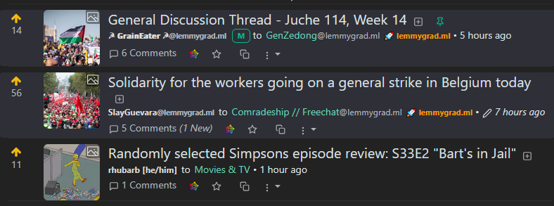
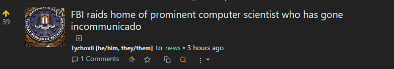
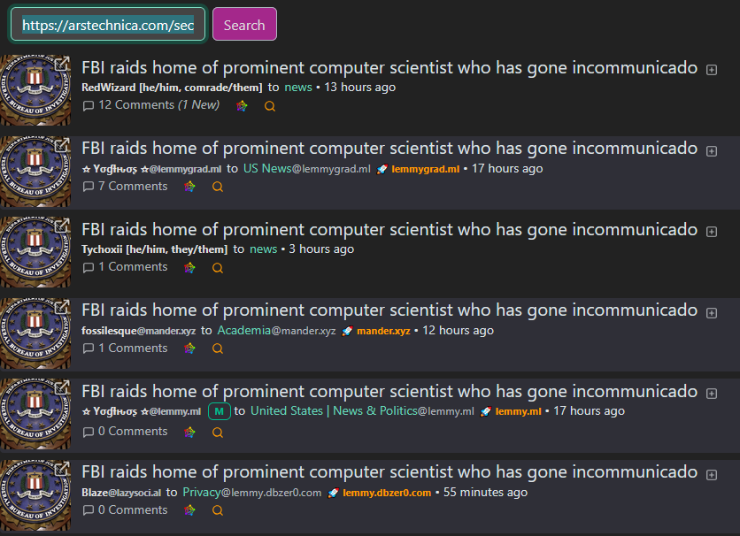

# Reds-Lemmy-Tools

This is a userscript that can be used with Tampermonkey or other userscript plugins.

## Features

This small utility adds the following features to the LemmyUI.

- External Community Highlight
- URL post "Quick Search" button in post feed
- Auto-Closes the Subscribed Communities sidebar.

### External Community Highlight

Posts in the feed that are made in a federated community will be highlighted. I implemented this so I could distiguish local posts from remote posts in the feed. See the screen shot below for an example of what this looks like.

### URL post "Quick Search" button in post feed

Posts that have an external URL as part of their post will have a 🔍 icon in the posts action button area. This button will open a new window to your instances search page, searching on the posts URL. I implemented this because the "Cross Posting" feature of the UI is frankly strange. Instead of some explicit "Cross Posting" list, I would rather just see where else the posts URL has been posted across federated communities. So, this search button will show you exactly that. This way you can find out where else this conversation is happeing, and engage with or read other comments on the topic.

**Search Button:**  

**Search Results:**  

### Auto-closes the Subscribed Communties sidebar

This one does what it says on the tin. My subscribed communities list is massive, and it stretches on forever it feels like. This simply clicks that minimize box for me when the page loads.

## Notes

1. The default match query is for Hexbear.net. You will want to update that with your prefered instance. `// @match        *://hexbear.net/*`
